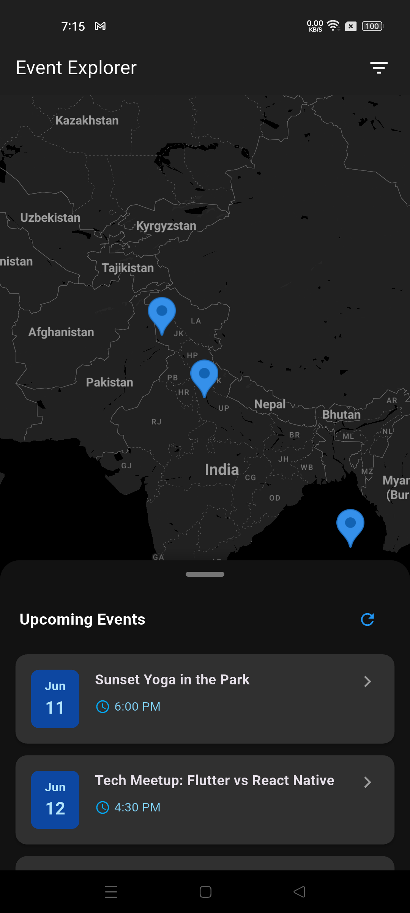

# Event Explorer - Map Interview Task

A Flutter application that displays events on an interactive map. This app allows users to explore events, filter them by time (upcoming/past), and view event details.

## Features

- Interactive Google Maps integration showing event locations
- Filter events by upcoming and past dates
- Bottom sheet event details with smooth animations
- Responsive UI with dark theme
- Error handling and network connectivity checks
- Mock API integration for event data

## Tech Stack

- **Flutter SDK**: ^3.7.2
- **Maps**: Google Maps Flutter (^2.12.2)
- **Networking**: HTTP package (^1.4.0) for API calls
- **Date Formatting**: Intl package (^0.20.2)
- **UI Components**: Material Design with Cupertino Icons (^1.0.8)

## Project Structure

```
lib/
├── main.dart                    # App entry point
├── models/                      # Data models
│   └── event.dart               # Event model class
├── repositories/                # Repository layer
│   └── event_repository.dart    # Business logic for events
├── screens/                     # UI screens
│   └── map_screen/              # Map screen and related widgets
└── services/                    # Service layer
    └── event_service.dart       # API service for fetching events
```

## Getting Started

1. Clone the repository
2. Ensure you have Flutter SDK installed (^3.7.2)
3. Run `flutter pub get` to install dependencies
4. Add your Google Maps API key in `android/app/src/main/AndroidManifest.xml` and `ios/Runner/AppDelegate.swift`
   - You can use the included scripts to update your API key automatically:
     - On macOS/Linux: `./update_maps_api_key.sh`
     - On Windows: `update_maps_api_key.bat`
     - With Python (any platform): `python update_maps_api_key.py`
5. Run the app with `flutter run`

### API Key Update Scripts

The project includes three scripts to easily update your Google Maps API key:

- **update_maps_api_key.sh**: Shell script for macOS, Linux, and Windows (with Git Bash or WSL)
- **update_maps_api_key.bat**: Batch script for Windows Command Prompt or PowerShell
- **update_maps_api_key.py**: Python script that works on all platforms with Python installed

These scripts will:
1. Prompt you for your Google Maps API key
2. Create a backup of the original AndroidManifest.xml file
3. Replace the placeholder API key with your provided key
4. Verify the change was successful

## API

The app uses a mock API endpoint for event data:
`https://6847d529ec44b9f3493e5f06.mockapi.io/api/v1/events`

## Screenshots



## License

This project is for demonstration purposes only.
